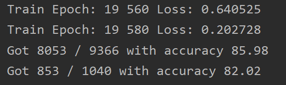
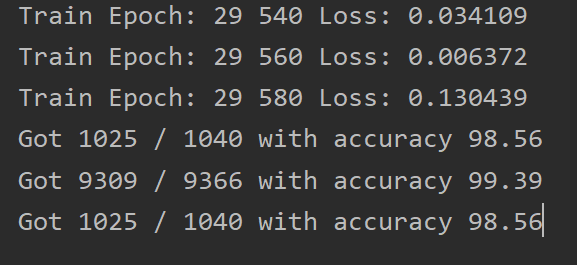

# Paddy Disease Classification

题目链接：https://www.kaggle.com/competitions/paddy-disease-classification

## 一、问题描述

大米（Oryza sativa）是世界范围内的主食之一。稻谷是去壳前的粗粮，主要在亚洲国家在热带气候中种植。水稻种植需要持续监督，因为多种疾病和害虫可能会影响水稻作物，导致高达 70% 的产量损失。通常需要专家监督来减轻这些疾病并防止作物损失。由于作物保护专家的可用性有限，人工疾病诊断既繁琐又昂贵。因此，通过利用在各个领域取得可喜成果的基于计算机视觉的技术来自动化疾病识别过程变得越来越重要。

## 二、数据集

提供了一个包含 10,407 个 (75%) 标记图像的训练数据集，涵盖 10 个类别（9 个疾病类别和正常叶片）。此外，我们还为每个图像提供额外的元数据（稻谷品种和年龄）。

将给定测试数据集中的 3,469 个（25%）图像中的每个水稻图像分类为九种疾病类别之一或正常叶子。

**train.csv** - 训练集

- `image_id`- 唯一图像标识符对应于**train_images**目录中的图像文件名 (.jpg)。
- `label`- 水稻病害类型，也是目标类别。有十类，包括正常的叶子。
- `variety`- 水稻品种的名称。
- `age`- 以天为单位的稻谷年龄。

**sample_submission.csv** - 样本提交文件。

**train_images** - 该目录包含 10,407 张训练图像，存储在对应于 10 个目标类的不同子目录下。文件名对应`image_id`于`train.csv`.

**test_images** - 此目录包含 3,469 个测试集图像。

## 三、项目文件结构

```
Paddy-Disease-Classification-Master/
│
├── train.py - main script to start training
├── check_accuracy.py - evaluation of model
├── submit.py - predict test images
│
├── model.py
│  
└── Paddy Doctor Dataset/ - dateset
	├── sample_submission.csv
	├── train.csv
    ├── test_images
    └── train_images
```

## 四、数据集加载


[pytorch](https://so.csdn.net/so/search?q=pytorch&spm=1001.2101.3001.7020)加载图片数据集有两种方法，根据数据集结构选择了ImageFolder 方法。

1. ImageFolder 适合于分类[数据集](https://so.csdn.net/so/search?q=数据集&spm=1001.2101.3001.7020)，并且每一个类别的图片在同一个文件夹, ImageFolder加载的数据集， 训练数据为文件件下的图片， 训练标签是对应的文件夹， 每个文件夹为一个类别
2. 根据pytorch提供的Dataset类创建自己的数据集加载类。

```

```

## 五、模型

模型A: Conv（in：3，out：8，3×3）→ MaxPool（2×2）→ Conv（in：8，out：16，3×3）→ MaxPool（2×2）→ FC

模型B：Conv（in：3，out：8，3×3）→ MaxPool（2×2）→ Conv（in：8，out：4，3×3）→ MaxPool（2×2）→ FC

模型C：Conv（in：3，out：8，5×5）→ MaxPool（2×2）→ Conv（in：8，out：4，3×3）→ MaxPool（2×2）→ FC

模型D：Conv（in：3，out：8，3×3）→ MaxPool（2×2）→Conv（in：8，out：6，3×3）→ MaxPool（2×2）→  Conv（in：6，out：4，3×3）→ FC

模型E：Conv（in：3，out：8，3×3）→ MaxPool（2×2）→Conv（in：8，out：6，3×3）→ MaxPool（2×2）→  Conv（in：6，out：8，3×3）→ FC

## 六、实验结果

| 模型 | input           | train loss | train acc | test acc |
| ---- | --------------- | ---------- | --------- | -------- |
| A    | 64×48           | 0.39       | 87.4      | 69.52    |
| A    | 64×48 normalize | 0.31       | 94.44     | 67.98    |
| A    | 128×96          | 0.025      | 99.38     | 69.90    |
| A    | 320×240         | 0.000110   | 100.0     | 64.23    |
| B    | 128×96          | 0.38       | 94.10     | 59.62    |
| C    | 128×96          | 0.33       | 94.05     | 58.17    |
| D    | 128×96          | 0.48       | 91.34     | 58.08    |
| E    | 128×96          | 0.048      | 98.37     | 67.60    |
| E    | 640×320         | 0.000023   | 100       | 52.60    |

结果分析：当分辨率大的时候参数多造成过拟合，另外再加上深度浅，使得感受野太小，无法很好地提取特征。所以后续采用了resnet进一步实验，在测评网站上达到了97%的准确率。

resnet34_分辨率224×224 _20epochs：



缩小学习率，继续训练：




## 后记

- ```
  用nn.CrossEntropyLoss()作为损失函数，label不需要onehot，不需要softmax层！
  ```

- 项目地址：https://github.com/TycoonL/Paddy-Disease-Classification-Master.git
